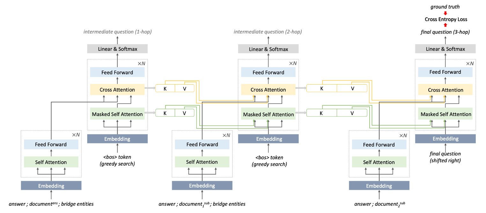

# E2EQR
Implementation of the LREC-COLING 2024 paper: ["Explainable Multi-hop Question Generation: An End-to-End Approach without Intermediate Question Labeling"](https://aclanthology.org/2024.lrec-main.599.pdf) (Refactored on March 5, 2026)



---

### Environment Setup

To run the code, install the following libraries or create a conda virtual environment using the provided `environment.yml` file.

```
python=3.10
transformers==4.29.0
torch==1.13.1+cu117
tqdm
spacy
pytextrank
networkx
nltk
rouge
```

You also need to download the `en_core_web_sm` package for spaCy:
```
python -m spacy download en
```

---

### Document Arrangement and Bridge Entity Extraction

1. Download the MuSiQue dataset from the official GitHub repository:

https://github.com/stonybrooknlp/musique

The following files will be used:

```
musique_ans_v1.0_{train|dev}.jsonl
```

2. The original test split does not contain gold supporting facts. Therefore:

- Split the original training set into new train and dev sets.
- Use the original dev set as the test set.

The final file names should be:

```
musique_{train|dev|test}.jsonl
```

3. Run the bridge entity extraction script:

```
python get_spanning_tree.py train
python get_spanning_tree.py dev
python get_spanning_tree.py test
```

3. The resulting files:

```
musique_bridge_{train|dev|test}.json
```

will be generated in the same directory.

### Model Training & Inference
You can train and evaluate the model using the provided shell script (`run_musique.sh`), or run the following command directly:

```
EPOCHS=50
BATCH_SIZE=4
LR=3e-5
WARMUP=1000

OUTPUT=output_musique
TAG=$EPOCHS.$BATCH_SIZE.$LR.$WARMUP
mkdir $OUTPUT

python run_e2eqr.py \
              --do_train \
              --train_data_file data/musique/musique_bridge_train.json \
              --valid_data_file data/musique/musique_bridge_dev.json \
              --test_data_file data/musique/musique_bridge_test.json \
              --epochs $EPOCHS \
              --batch_size $BATCH_SIZE \
              --learning_rate $LR \
              --warmup_steps $WARMUP \
              --output $OUTPUT \
              --exp_tag $TAG
```

